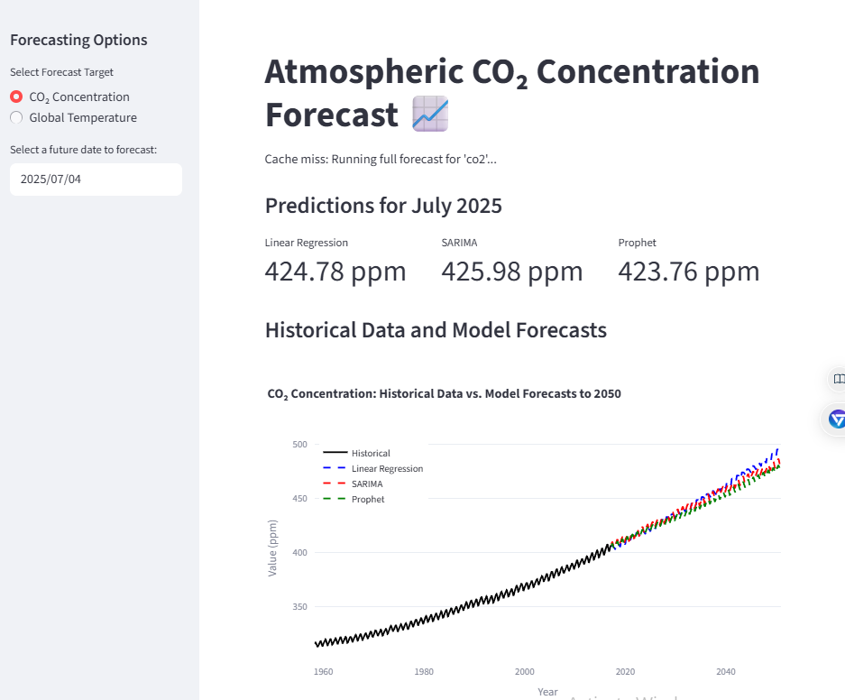
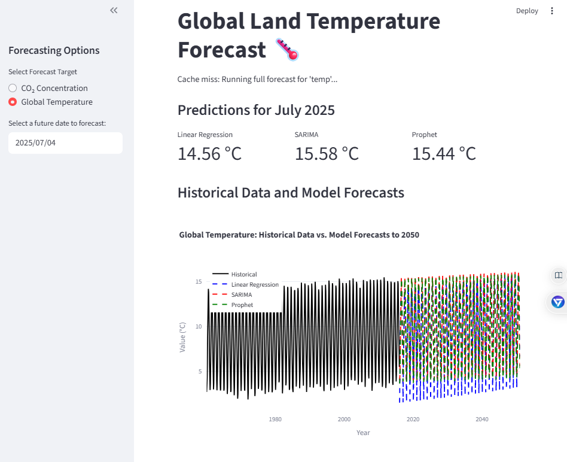

# Climate Forecast Dashboard 📈🌡️

This project analyzes historical CO₂ and global temperature data and provides a web-based dashboard for forecasting future values using machine learning.

<!-- ACTION: Replace this with a wide screenshot of your app named app_screenshot.png -->


## Overview

This project tackles the challenge of time-series forecasting for two key climate metrics:
1.  **Atmospheric CO₂ Concentration:** Using the Mauna Loa dataset (1958-2017).
2.  **Global Average Land Temperature:** Using the Berkeley Earth dataset. For modern forecasting, the data from 1960-2015 was used.

The application allows users to select their target metric and receive on-demand forecasts from three different models.

## Live Application Views

The dashboard provides a dynamic interface to switch between forecast targets.

<!-- ACTION: Replace these with screenshots of the CO₂ and Temperature views of your app -->
<p float="left">
  
   
</p>

## Tech Stack

- **Data Analysis:** Pandas, NumPy, Scikit-learn
- **Machine Learning & Forecasting:** Statsmodels (for SARIMA), Prophet
- **Web App & Visualization:** Streamlit, Plotly
- **Serialization:** Pickle

## Model Performance

The models were trained on historical data and evaluated on unseen future data. **Prophet** performed best for CO₂ forecasting, while **SARIMA** was the most accurate for temperature forecasting, highlighting that the optimal model can vary by dataset.

### CO₂ Concentration Forecast Evaluation

| Model             | MAE    | RMSE   |
|-------------------|--------|--------|
| Linear Regression | 1.4893 | 1.8006 |
| SARIMA            | 0.9736 | 1.3164 |
| **Prophet**       | **0.9679** | **1.3064** |
*Units: parts per million (ppm). Lower is better.*

### Global Temperature Forecast Evaluation

| Model             | MAE    | RMSE   |
|-------------------|--------|--------|
| Linear Regression | 1.0093 | 1.2595 |
| **SARIMA**        | **0.2105** | **0.2893** |
| Prophet           | 0.3459 | 0.4366 |
*Units: degrees Celsius (°C). Lower is better.*

## Project Structure

```
/climate-forecast-dashboard/
├── data/
│   └── archive.csv
├── berkeleyearth/
│   └── GlobalTemperatures.csv
├── models/
│   ├── *.pkl
│   └── *.csv
├── Climate_Analysis_and_Forecasting.ipynb
├── app.py
├── save_models.py
├── requirements.txt
├── app_screenshot.png
├── co2_view.png
├── temperature_view.png
└── README.md
```

## How to Run This Project Locally

1.  **Clone the repository:**
    ```bash
    git clone https://github.com/your-username/your-repo-name.git
    cd your-repo-name
    ```

2.  **Create and activate a virtual environment (recommended):**
    ```bash
    python -m venv venv
    source venv/bin/activate  # On Windows, use `venv\Scripts\activate`
    ```

3.  **Install the dependencies:**
    ```bash
    pip install -r requirements.txt
    ```

4.  **Train and save all models:**
    (This only needs to be done once. It will train and save models for both CO₂ and temperature.)
    ```bash
    python save_models.py
    ```

5.  **Run the Streamlit web app:**
    ```bash
    streamlit run app.py
    ```
    The application will open in your web browser. Use the sidebar to switch between CO₂ and Temperature forecasts.